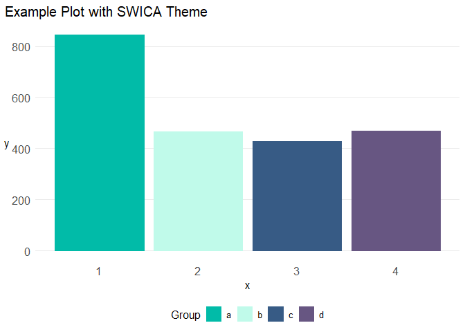

<!-- README.md is generated from README.Rmd. Please edit that file -->

# swicatheme

<!-- badges: start -->
<!-- badges: end -->

## Note

SWICA fonts must be installed.

## Example

``` r
library(ggplot2)
library(swicatheme)

dftest <- data.frame(
  x = rep(1:4),
  y = rnorm(4, mean = 500, sd = 200),
  group = rep(letters[1:4])
)

ggplot(dftest, aes(x = x, y = y, color = group, fill = group)) +
  geom_bar(stat = "identity", position = "dodge") +
  scale_colour_swica_discrete("swica_discrete") +
  scale_fill_swica_discrete("swica_discrete") +
  theme_swica() +
  labs(
    title = "Example Plot with SWICA Theme",
    color = "Group",
    fill = "Group"
  )
#> SWICA fonts are installed.
#> Warning in grid.Call(C_stringMetric, as.graphicsAnnot(x$label)):
#> Zeichensatzfamilie in der Windows Zeichensatzdatenbank nicht gefunden
#> Warning in grid.Call(C_stringMetric, as.graphicsAnnot(x$label)):
#> Zeichensatzfamilie in der Windows Zeichensatzdatenbank nicht gefunden
#> Warning in grid.Call(C_textBounds, as.graphicsAnnot(x$label), x$x, x$y, :
#> Zeichensatzfamilie in der Windows Zeichensatzdatenbank nicht gefunden
#> Warning in grid.Call(C_stringMetric, as.graphicsAnnot(x$label)):
#> Zeichensatzfamilie in der Windows Zeichensatzdatenbank nicht gefunden
#> Warning in grid.Call(C_textBounds, as.graphicsAnnot(x$label), x$x, x$y, :
#> Zeichensatzfamilie in der Windows Zeichensatzdatenbank nicht gefunden
#> Warning in grid.Call(C_textBounds, as.graphicsAnnot(x$label), x$x, x$y, :
#> Zeichensatzfamilie in der Windows Zeichensatzdatenbank nicht gefunden
#> Warning in grid.Call(C_textBounds, as.graphicsAnnot(x$label), x$x, x$y, :
#> Zeichensatzfamilie in der Windows Zeichensatzdatenbank nicht gefunden
#> Warning in grid.Call.graphics(C_text, as.graphicsAnnot(x$label), x$x, x$y, :
#> Zeichensatzfamilie in der Windows Zeichensatzdatenbank nicht gefunden
#> Warning in grid.Call.graphics(C_text, as.graphicsAnnot(x$label), x$x, x$y, :
#> Zeichensatzfamilie in der Windows Zeichensatzdatenbank nicht gefunden
```


